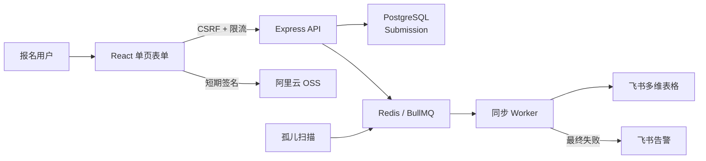

# FBIF 2026 观众注册系统


FBIF 食品创新展 2026 观众注册系统。系统面向行业观众和消费者提供单页报名流程，先将提交可靠写入 PostgreSQL，再通过 BullMQ 异步同步到飞书多维表格；附件上传、身份验证、广告归因、失败重试和告警均围绕这条主链路展开。

## 核心能力

- **双角色报名**：行业观众与消费者使用同一应用，根据角色呈现不同字段和校验规则。
- **可靠接收**：表单先写 PostgreSQL，再异步入队；接口通过 `clientRequestId` 保证提交幂等。
- **飞书异步同步**：Worker 负责写入多维表格，支持并发、QPS 控制、指数退避和失败状态跟踪。
- **孤儿任务恢复**：周期扫描已接收但未成功入队的提交，并重新放入同步队列。
- **附件直传 OSS**：浏览器获取短期上传策略后直传 OSS，API 只保存受控 URL。
- **可选实名验证**：可接入阿里云市场身份证二要素校验；未启用时不影响普通报名。
- **广告归因**：保存 click id、来源键和通用 tracking 参数，便于后续渠道分析。
- **安全防护**：CSRF、CORS、Helmet、Redis 限流、敏感字段加密和哈希索引。
- **可观测性**：健康检查、Prometheus 指标、结构化日志和飞书失败告警。

## 数据流



HTTP 接口接受成功只代表数据已可靠进入本系统；最终飞书同步状态通过提交状态接口查询。

## 技术栈

| 层级 | 技术 |
| --- | --- |
| 前端 | React 18.3、TypeScript 5.5、Vite 5、Vitest |
| 后端 | Node.js 20、Express 4、TypeScript、Zod |
| 数据访问 | Prisma 5、PostgreSQL 16 |
| 队列 | BullMQ 5、Redis 7 |
| 安全 | Helmet、CSRF、CORS、Redis rate limit、AES-256 |
| 可观测性 | Pino、Prometheus `prom-client`、飞书机器人告警 |
| 部署 | Docker Compose、Caddy、主机 Nginx、GitHub Actions |

## 项目结构

```text
.
├── apps/
│   ├── web/                    # React 报名页面
│   ├── api/                    # Express API、Prisma、Worker
│   └── mock-api/               # 本地联调 Mock API
├── docs/                       # API、部署、运维、性能与事故文档
├── tests/
│   ├── k6/                     # K6 压测场景
│   └── load/                   # Shell 混合负载脚本
├── scripts/                    # 本地栈、蓝绿部署、回滚与部署验证
├── deploy/                     # Caddy 配置模板
├── docker-compose.yml          # 本地 PostgreSQL + Redis
├── docker-compose.production.yml
└── .github/workflows/          # Preview、生产和维护工作流
```

## 快速开始

### 1. 启动依赖

```bash
docker compose up -d
```

### 2. 启动 API

```bash
cd apps/api
cp .env.example .env
npm ci
npm run prisma:generate
npm run prisma:migrate
npm run dev
```

API 默认监听 `http://localhost:8080`。

### 3. 启动 Web

```bash
cd apps/web
cp .env.example .env
npm ci
npm run dev
```

前端默认监听 `http://localhost:5173`。

### 一键本地联调

仓库还提供前端预览与 Mock API 管理脚本：

```bash
node scripts/local-stack.mjs start
node scripts/local-stack.mjs status
node scripts/local-stack.mjs stop
```

详细说明见[本地开发环境文档](./docs/local-dev-environment.md)。

## 配置

以后端模板 [`apps/api/.env.example`](./apps/api/.env.example) 为准。下表只列配置分组，不包含任何生产值。

| 分组 | 关键变量 | 说明 |
| --- | --- | --- |
| 服务 | `NODE_ENV`、`PORT`、`WEB_ORIGIN`、`TRUST_PROXY_HOPS` | 运行环境、监听端口、CORS 与代理层数 |
| 数据 | `DATABASE_URL`、`REDIS_URL` | PostgreSQL 与 Redis 连接 |
| 加密 | `DATA_KEY`、`DATA_HASH_SALT` | 敏感字段加密与稳定哈希；生产必须使用独立强密钥 |
| 飞书 | `FEISHU_APP_ID/SECRET`、`FEISHU_APP_TOKEN`、`FEISHU_TABLE_ID` | 应用凭证与目标多维表格 |
| 同步 | `FEISHU_SYNC_*`、`FEISHU_WORKER_*`、`SWEEP_PENDING_INTERVAL_MS` | 重试、并发、频率和孤儿扫描 |
| OSS | `OSS_*` | 可选附件直传配置 |
| 实名验证 | `ID_VERIFY_ENABLED`、`ID_VERIFY_APPCODE` | 可选身份证验证能力 |
| 告警 | `FEISHU_ALERT_WEBHOOK`、`FEISHU_ALERT_ENABLED` | 最终同步失败告警 |
| 限流 | `RATE_LIMIT_*`、`CSRF_RATE_LIMIT_*` | 通用 API 与 CSRF 接口限流 |

前端只需要配置 API 地址和同步等待时间，见 [`apps/web/.env.example`](./apps/web/.env.example)。`.env`、数据库备份、真实证件信息和访问凭证不得提交到 Git。

## API

| 方法 | 路径 | 说明 |
| --- | --- | --- |
| `GET` | `/health` | 服务与依赖健康检查 |
| `GET` | `/metrics` | Prometheus 指标 |
| `GET` | `/api/csrf` | 获取 CSRF token |
| `POST` | `/api/submissions` | 校验并创建报名提交，成功返回异步处理标识 |
| `GET` | `/api/submissions/:id/status` | 查询飞书同步状态 |
| `POST` | `/api/oss/policy` | 获取 OSS 直传策略 |
| `POST` | `/api/id-verify` | 可选身份证二要素验证 |

接口合同和错误响应见 [`docs/api.md`](./docs/api.md)。

## 可靠性与安全边界

- PostgreSQL 是报名提交的事实源；飞书是协作和运营消费端，不承担接收入口的可靠性。
- `clientRequestId` 唯一约束防止浏览器重试造成重复提交。
- Worker 对暂时性错误执行有限重试；达到上限后标记失败并告警，不做无限重试。
- 手机号、证件号等敏感字段加密保存，哈希仅用于精确去重或查询。
- API 不代理大附件正文，浏览器使用短期签名直接上传 OSS。
- `/metrics`、日志和告警不得输出明文证件号、手机号、密钥或完整第三方错误体。
- 生产与 Preview 使用独立 Docker 项目、数据库和 Redis；部署脚本包含端口隔离与漂移检查。
- Prisma 生产迁移必须向后兼容；破坏性 schema 变更应进入独立维护窗口。

## 测试与构建

```bash
# Web
cd apps/web
npm ci
npm test
npm run build

# API
cd apps/api
npm ci
npm test
npm run build

# Mock API
cd apps/mock-api
npm ci
npm test
```

负载场景位于 `tests/k6/` 和 `tests/load/`。性能报告只能代表对应日期、配置和数据规模，不能直接视为当前生产容量承诺。

## 发布与部署

- **Preview**：推送到 `main` 后由 `.github/workflows/deploy-preview.yml` 自动部署，用于验收。
- **生产**：通过 `.github/workflows/deploy-aliyun.yml` 手动触发，执行蓝绿发布、健康检查和失败回滚。
- **迁移**：API 容器启动时可执行 `prisma migrate deploy`；迁移策略必须保持向后兼容。
- **维护**：飞书元数据回填默认提供 dry-run，应用写入需要显式确认。

部署拓扑与操作步骤见：

- [发布流程](./docs/release-flow.md)
- [部署指南](./docs/deploy-guide.md)
- [环境真相图](./docs/repo-deploy-truth-map.md)
- [生产端口隔离手册](./docs/production-port-isolation-runbook.md)
- [部署后检查](./docs/runbook.md)

## 文档索引

| 文档 | 用途 |
| --- | --- |
| [`docs/user-manual.md`](./docs/user-manual.md) | 报名用户与运营使用说明 |
| [`docs/api.md`](./docs/api.md) | API 请求、响应和错误合同 |
| [`docs/feishu-setup.md`](./docs/feishu-setup.md) | 飞书应用与字段映射配置 |
| [`docs/aliyun-id-verify-integration.md`](./docs/aliyun-id-verify-integration.md) | 可选实名验证接入 |
| [`docs/tencent-ads-attribution-spec.md`](./docs/tencent-ads-attribution-spec.md) | 广告归因字段规范 |
| [`docs/stability-assessment.md`](./docs/stability-assessment.md) | 稳定性边界与整改记录 |
| [`docs/performance-report.md`](./docs/performance-report.md) | 历史性能测试结果与前提 |

## 仓库边界

本仓库是私有内部系统，未声明开源许可证。提交代码或文档前必须清除真实报名数据、生产地址、飞书标识、访问凭证、数据库连接串和排障样本中的个人信息。
